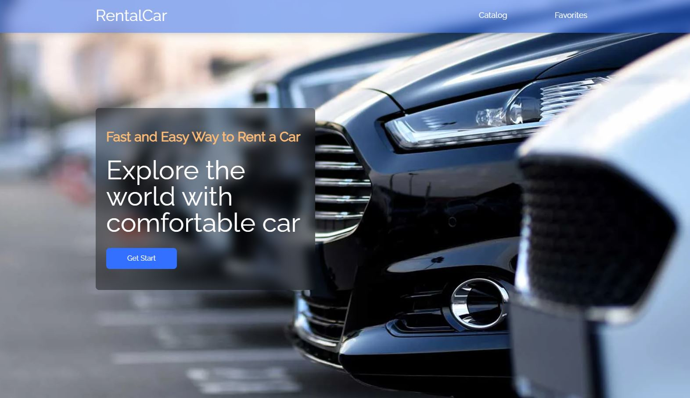
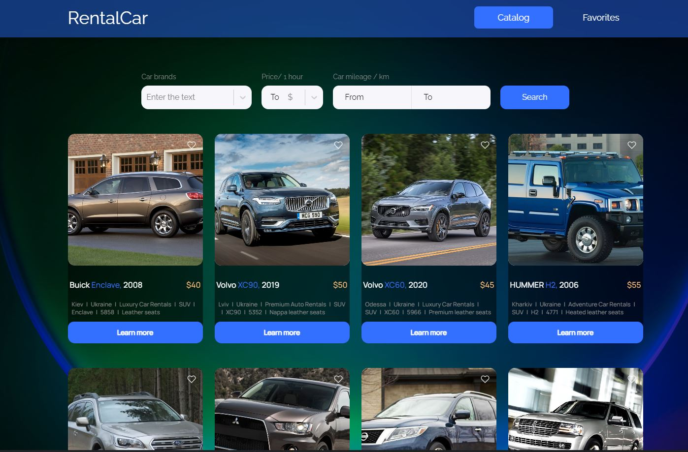
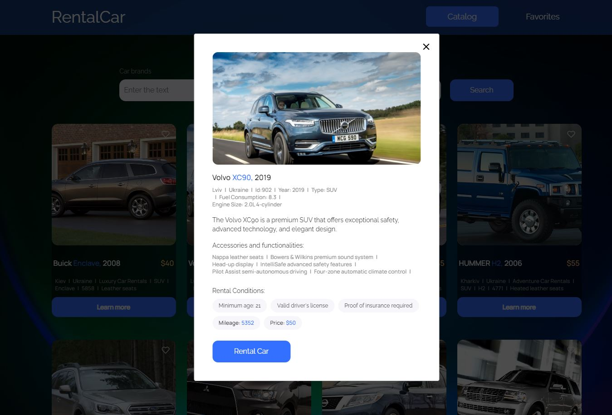
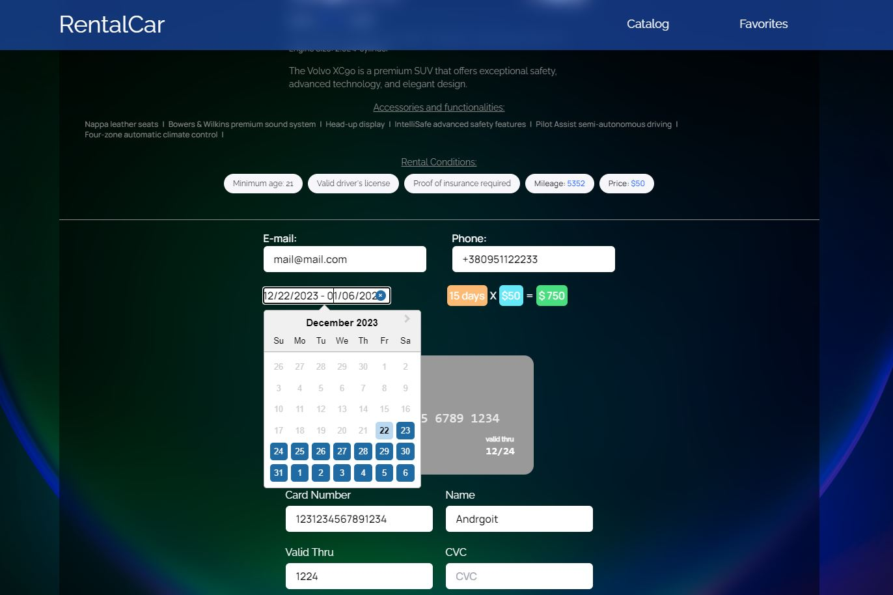

# Rent Car Website

Адаптивный РЕТ-проект, написанный при помощи React, redux, tailwindcss ...






### Для запуска приложения у себя на компьютере необходимо:

- склонировать данный репозиторий себе на компьютер

```js
git clone https://github.com/Andrgoit/rent-car.git
```

- установить все зависимости

```js
npm i
```

или

```js
npm install
```

- запустить проект

```js
npm start
```
